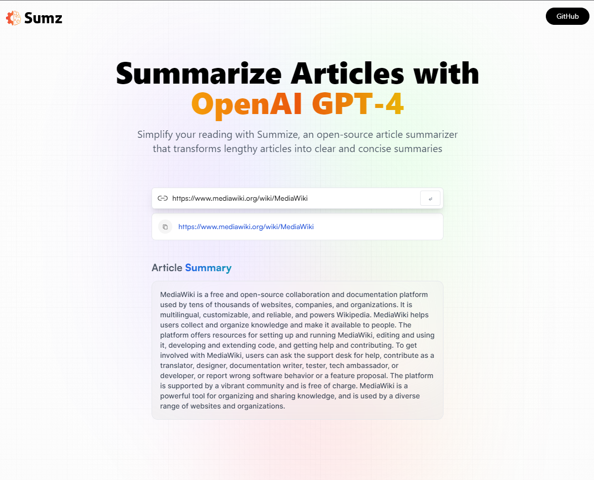

# GPT-AI-Summarizer
## Welcome! 👋

Thanks for checking out this Application.

## Overview
Summize is an open-source article summarizer that can help you simplify your reading. It transforms lengthy articles into clear and concise summaries, so you can get the key points without having to read the entire article. With Summize, you can save time and focus on the most important information in any article. Whether you're a student, a busy professional, or just someone who wants to stay informed, Summize is a great tool for simplifying your reading.

### Links

- App URL: [Github](https://github.com/shaheen7a/GPT-AI-Summarizer)
- APK Link: [Netlify](https://ai-gpt-summrizer.netlify.app/)

## My process

### Built with

- React JS
- Vite JS
- React Redux
- Redux Toolkit
- CSS
- JavaScript
- JSX

## Author

- Linkedin - [@aous-shaheen-381636221](https://www.linkedin.com/in/shaheen2001/)
- Facebook - [@aoushaheen7](https://www.facebook.com/shaheen72001/)

By me 🚀🚀🚀

